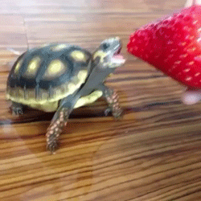

# Engineering_4_Notebook

&nbsp;

## Table of Contents
* [Launch Pad Part 1](#Launch_Pad_Part_1)
* [Launch Pad Part 2](#Launch_Pad_Part_2)
* [Raspberry_Pi_Assignment_Template](#raspberry_pi_assignment_template)
* [Onshape_Assignment_Template](#onshape_assignment_template)

### Launch Pad Part 1

We were instructed to print a countdown from 10 to 0 to our serial monitor and then print "Liftoff" when you reach zero.

### Evidence 

https://github.com/nbednar2929/Engineering_4_Notebook/assets/91289646/f7809c44-0927-4fc5-9968-a9e7f983bd40
    
### Wiring

There was no wiring for this assignment.

### Code

``` python
import time
import board # type: ignore
import digitalio # type: ignore

for i in range (10,0,-1): #for loop from 10 to 0 counting by 1
    print(i) #prints counter
    time.sleep(1) # 1 second delay
print("Liftoff") #print liftoff at the end of the countdown
```

### Reflection

This was a fairly basic assignment to get us back into the swing of things. I originally took a more convoluted approach to this assignment creating a "countdown" variable which wasn't nearly as concise as my final product after a bit of inspiration from my peers.

## Launch Pad Part 2

### Assignment Description

Wire two LEDs, a red one to blink every second and a green one to turn on when you have liftoff.

### Evidence 

https://github.com/nbednar2929/Engineering_4_Notebook/assets/91289646/8bce27e9-6922-4650-96eb-75fd628076b5

### Wiring

<details>
<summary><b>Wiring Diagram</b></summary>

<p>
    


</p>

</details>

### Code

```python
#type: ignore
import time
import board 
import digitalio 

Red = digitalio.DigitalInOut(board.GP1) #initialize red led 
Red.direction = digitalio.Direction.OUTPUT
Green = digitalio.DigitalInOut(board.GP0) #initialize green led 
Green.direction = digitalio.Direction.OUTPUT

for i in range (10,0,-1): #for loop from 10 to 0 counting by 1
    print(i) #prints counter
    Red.value = True #turn red led on
    time.sleep(.2)
    Red.value = False #turn red led off
    time.sleep(.8) # 1 second delay    
print("Liftoff") #print liftoff at the end of the countdown
Green.value = True #turn on green led for 5 seconds
time.sleep(5)
```

### Reflection

This assignment was also pretty easy since we were just building off of part 1. All I had to do was initialize two LEDs and turn on the Red LED in the "for loop". The one difficult part was realizing I needed to add a sleep after turning on the Green LED or else it would instantly reset and never turn on.


&nbsp;

# Templates

&nbsp;

## Raspberry_Pi_Assignment_Template

### Assignment Description

Write your assignment description here. What is the purpose of this assignment? It should be at least a few sentences.

### Evidence 

Pictures / Gifs of your work should go here. You need to communicate what your thing does. 

### Wiring

This may not be applicable to all assignments. Anything where you wire something up, include the wiring diagram here. The diagram should be clear enough that I can recreate the wiring from scratch. 

### Code
Give me a link to your code. [Something like this](https://github.com/millerm22/Engineering_4_Notebook/blob/main/Raspberry_Pi/hello_world.py). Don't make me hunt through your folders, give me a nice link to click to take me there! Remember to **COMMENT YOUR CODE** if you want full credit. 

### Reflection

What went wrong / was challenging, how'd you figure it out, and what did you learn from that experience? Your goal for the reflection is to pass on knowledge that will make this assignment better or easier for the next person. Think about your audience for this one, which may be "future you" (when you realize you need some of this code in three months), me, or your college admission committee!

&nbsp;

## Onshape_Assignment_Template

### Assignment Description

Write your assignment description here. What is the purpose of this assignment? It should be at least a few sentences.

### Part Link 

[Create a link to your Onshape document](https://cvilleschools.onshape.com/documents/003e413cee57f7ccccaa15c2/w/ea71050bb283bf3bf088c96c/e/c85ae532263d3b551e1795d0?renderMode=0&uiState=62d9b9d7883c4f335ec42021). Don't forget to turn on link sharing in your Onshape document so that others can see it. 

### Part Image

Take a nice screenshot of your Onshape document. 

### Reflection

What went wrong / was challenging, how'd you figure it out, and what did you learn from that experience? Your goal for the reflection is to pass on knowledge that will make this assignment better or easier for the next person. Think about your audience for this one, which may be "future you" (when you realize you need some of this code in three months), me, or your college admission committee!

&nbsp;

## Media Test
Your readme will have various images and gifs on it. Upload a test image and test gif to make sure you've got the process figured out. Pick whatever image and gif you want!

### Test Link

[Hyperlink text](http://www.turtle.com)        

### Test Image

  

### Test GIF

  
